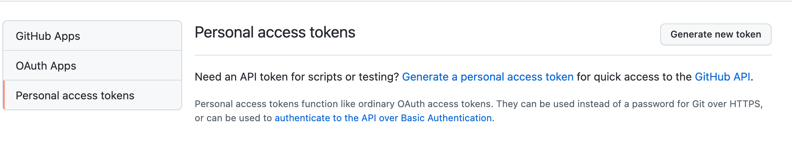

# 使用GitHub Actions自动创建issues

## 任务: 
- **js 创建 issue**
- **自动执行任务**
- **定时执行任务**

## 开发步骤
### Step1: 测试 octokit 库
[octokit](https://www.npmjs.com/package/octokit#authentication)
```javascript
// main.js
const {
  Octokit
} = require('octokit');

const templates = `
  ## Todos
  - [ ] test
  ## WorkLog
`

const octokit = new Octokit({
	// personal Access Token
  auth: ''
});

octokit.rest.issues.create({
  owner: "PaulChess",
  repo: "work-everyday-mark",
  title: "Hello Issue",
  body: templates
});
```

```shell
# node main.js
```
结果: 可以成功在指定仓库下新建指定issue

### Step2: 新建 action.yaml
[creating a javascript action](https://docs.github.com/en/actions/creating-actions/creating-a-javascript-action)

```YAML
# action.yaml
name: 'automatically create issue'
description: 'automatically create issue'
runs:
  using: 'node12'
  main: 'main.js'
```

注意:
由于node各个版本的使用上有差异，因此需要使用 `@vercel/ncc` 这个库做一下编译，且每次有代码改动的时候都要记得做一次编译。

```json
{
  "scripts": {
    "build": "ncc build index.js --license licenses.txt"
  }
}
```

`action.yaml` 修改如下:
```diff
# action.yaml
name: 'automatically create issue'
description: 'automatically create issue'
runs:
  using: 'node12'
- main: 'main.js'
+ main: 'dist/index.js'
```

### Step3: 新建 .github/workflows/main.yaml
```YAML
on: [push]

jobs:
  create_issue:
    runs-on: ubuntu-latest
    name: create issue automatically
    steps:
      - name: first step
        uses: PaulChess/automatically-create-issue@main # 这里需要修改成自己的仓库
```

执行 push 操作的时候会自动触发脚本。
执行结果: 




可以看到执行失败，且 `Personal access tokens` 中创建的auth也被干掉了。
这是因为token是不能以明文出现在脚本中的。

这时我们需要拿到 `Person access tokens` 中生成的auth, 在仓库的设置下面生成 `enviroment secret`，这里我们给环境变量起名为 `TOKEN`

### Step4: 接收TOKEN，代码调整
```diff
# .github/workflows/main.yaml
on: [push]

jobs:
  create_issue:
    runs-on: ubuntu-latest
    name: create issue automatically
    steps:
      - name: first step
        uses: PaulChess/automatically-create-issue@main
+        with:
+          TOKEN: ${{ secrets.TOKEN }}
```
```diff
# action.yaml
name: 'automatically create issue'
description: 'automatically create issue'
+ inputs:
+  TOKEN:  # id of input
+    description: 'secret token'
+    required: true
runs:
  using: 'node12'
  main: 'dist/index.js'
```
```javascript
// main.js
const core = require('@actions/core');

const TOKEN = core.getInput('TOKEN');

const octokit = new Octokit({
  auth: TOKEN
});
```
打包后重新提交代码，`成功！`

### Step5: 定时执行


由于运行在UTC时区，`hour` 需要用北京时间减去 `8`
```YAML
# .github/worflows/main.yaml
on:
  schedule:
    - cron: '0 23 * * *' # 北京时间早上7点自动创建
```

```javascript
// main.js
function getTitle() {
  // 运行环境是 UTC 时区
  // 需要转换成 中国时区
  // 中国时区 = UTC时区 + 8小时
  return `【每日工作】${dayjs().add("8", "hour").format('YYYY-MM-DD')}`;
}
octokit.rest.issues.create({
  owner: "PaulChess",
  repo: "work-everyday-mark",
  title: getTitle(),
  body: templates
});
```

### 最后

上述文字是看过崔大佬视频加以成功实践后的总结，原视频地址如下: https://www.bilibili.com/video/BV1F34y1U7JT?spm_id_from=333.999.0.0